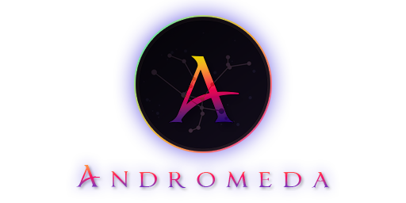

<div align="center">

# 
[]()
[](https://discord.gg/86wbfZXxn7)
[](https://jq.qq.com/?_wv=1027&k=LStIpBBc)
[](https://github.com/fafaraway/andromeda/blob/development/LICENSE)
[](https://github.com/fafaraway/andromeda/actions)
[](https://github.com/fafaraway/andromeda/releases)

</div>


## Introduction
**Andromeda** is a user interface replacement **AddOn** for **World of Warcraft**.  
It provides many useful features while maintaining **beauty**, **elegance**, and **efficiency**.  
Accompany you through every challenging day in **Azeroth**.  

## Screenshots
*  https://imgur.com/a/0JfIGql

## Videos
*  https://www.youtube.com/watch?v=ntiwQZEg-i8
*  https://www.bilibili.com/video/BV1uR4y1V7VY/

## Feedback
*  Report issues on [GitHub](https://github.com/fafaraway/andromeda/issues)
*  Join [Discord Channel](https://discord.gg/86wbfZXxn7)
*  加入QQ群 [203621176](https://jq.qq.com/?_wv=1027&k=LStIpBBc)

## Download
New versions of **Andromeda** are automatically and synchronously released to **CurseForge**, **WowInterface** and **Wago**, and can be downloaded directly from these sites or automatically updated using third-party addon managers.
*  [CurseForge](https://www.curseforge.com/wow/addons/andromeda)
*  [Wago](https://addons.wago.io/addons/andromeda)
*  [WoWInterface](https://www.wowinterface.com/downloads/fileinfo.php?id=23258)

## Usage
```
/and
/and --help
/and --install
/and --gui
/and --unlock
/and --reset
```

## Additional
*  [WeakAuras Collection](https://wago.io/WloMMMBpx) *WA collection*
*  [Clean Icons - Mechagnome Edition](https://github.com/AcidWeb/Clean-Icons-Mechagnome-Edition) *Icons replacement with high resolution*
*  [Chinese Fonts Pack](https://1drv.ms/u/s!AocaDk73Gt7sgrk6bdKqfZGZQMQA2Q?e=QwjHh2) *Fonts replacement for Chinese game client*
*  [Interface Textures](https://1drv.ms/u/s!AocaDk73Gt7sgrlAYVUKxYvs3pCGFg?e=KpJOfv) *Textures replacement for chat bubble in protected area*

## License
*  **Andromeda** is a free and open-source project written in Lua and distributed under the **GNU General Public License v3**.
*  See [LICENSE](/LICENSE) for more information.

## Acknowledgments
*  [Haleth](https://github.com/Haleth), [siweia](https://github.com/siweia), [Gethe](https://github.com/Gethe), [Zorker](https://github.com/zorker), [p3lim](https://github.com/p3lim), [silverwind](https://github.com/silverwind), [Rubgrsch](https://github.com/Rubgrsch), [EKE00372](https://github.com/EKE00372), [fang2hou](https://github.com/fang2hou), [lilbit26](https://github.com/lilbit26), [Djamy](https://github.com/Djamy), [Hxcktivist](https://github.com/Hxcktivist), [rgd87](https://github.com/rgd87), [Witnesscm](https://github.com/Witnesscm), [Wetxius](https://github.com/Wetxius), [Ketho](https://github.com/Ketho)
*  [FreeUI](https://github.com/Haleth/FreeUI), [NDui](https://github.com/siweia/NDui), [NDui_Plus](https://github.com/Witnesscm/NDui_Plus), [ShestakUI](https://github.com/Shestak/ShestakUI), [RealUI](https://github.com/RealUI/RealUI), [ElvUI](https://github.com/tukui-org/ElvUI), [ElvUI_WindTools](https://github.com/fang2hou/ElvUI_WindTools)
*  [oUF](https://github.com/oUF-wow/oUF), [Ace3](https://www.wowace.com/projects/ace3), [cargBags](https://github.com/cschomburg/cargBags)

